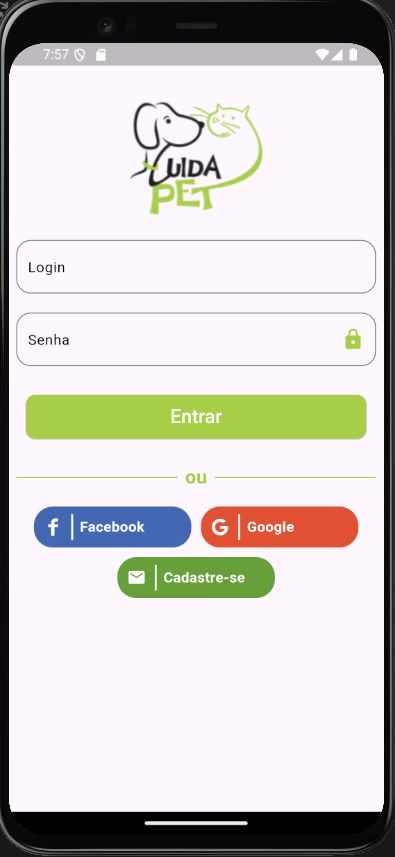
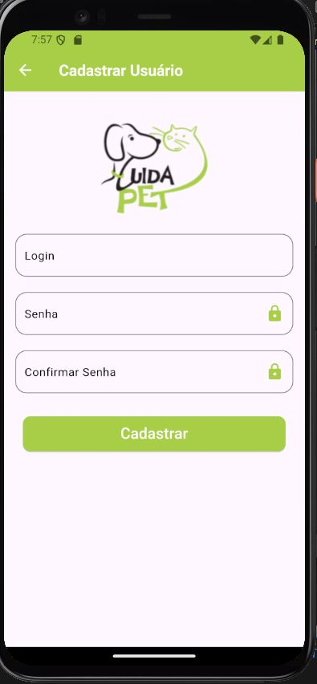
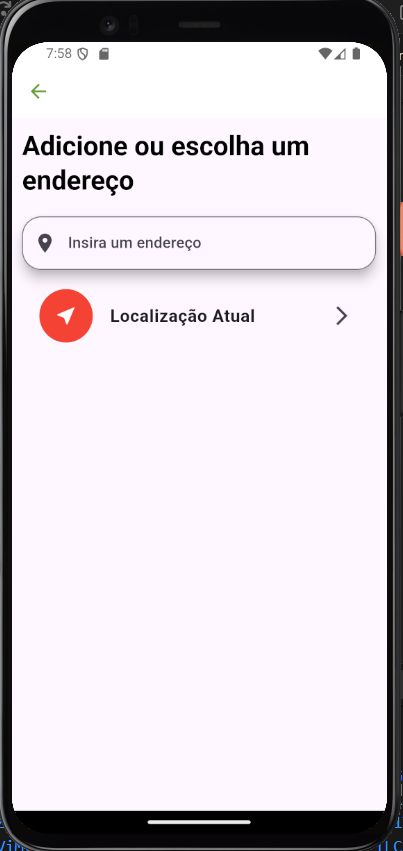
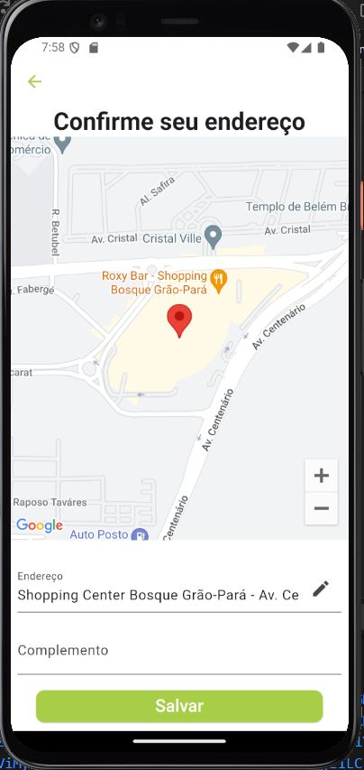
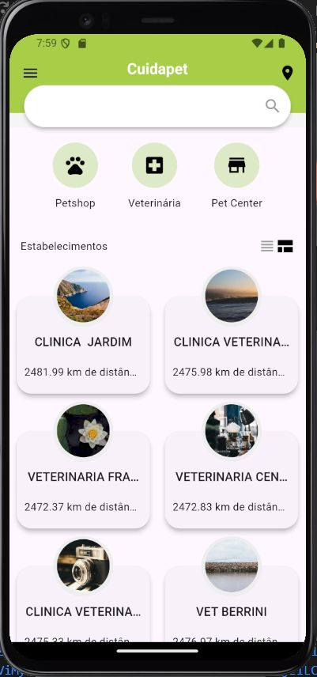
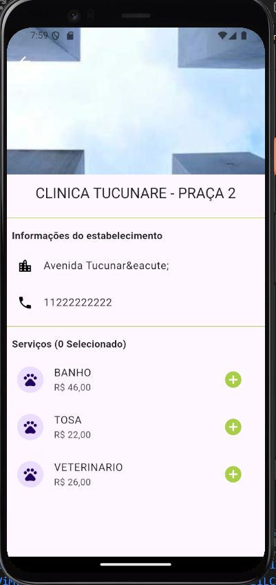

# CuidaPet

A modern pet care services application built with Flutter using Modular Architecture with MobX for state management.

## 📱 About

CuidaPet is a comprehensive mobile application that connects pet owners with nearby pet shops and veterinary services. The app allows users to browse services, schedule appointments, and manage their pets' care needs. The app features a clean and intuitive user interface with a focus on user experience.

## 🏗️ Architecture

This project follows **Modular Architecture with MobX** principles:

- **MobX**: Manages state and business logic, separating it from the UI
- **Flutter Modular**: Handles dependency injection and routing
- **Repository Pattern**: Abstracts data sources, providing a clean API for the domain layer
- **Service Layer**: Implements business logic and connects repositories with controllers
- **Feature-based Structure**: Organized by modules rather than technical concerns

## 🛠️ Tech Stack

- **Flutter**: UI framework
- **Dart**: Programming language
- **MobX**: State management
- **Flutter Modular**: Dependency injection and routing
- **Dio**: HTTP client for API communication
- **SQLite**: Local database
- **Firebase**: Authentication, Analytics, and Remote Config
- **Shared Preferences & Flutter Secure Storage**: Local storage
- **Google Maps**: Location services
- **Validatorless**: Form validation
- **Flutter Dotenv**: Environment configuration

## 🌟 Features

- User authentication (email/password, Google, Facebook)
- Pet shop search and filtering
- Location-based services
- Address management
- Service scheduling and appointment tracking
- User profile management
- Pet registration and management

## 🚀 Getting Started

### Prerequisites

- Flutter SDK (>=3.0.0 <4.0.0)
- Dart SDK
- Android Studio / VS Code
- Android/iOS emulator or physical device
- Firebase project setup
- Google Maps API key

### Environment Setup

1. Clone the repository
2. Create a `.env` file in the root directory with the following variables:
   ```
   BASE_URL=your_api_base_url
   GOOGLE_API_KEY=your_google_maps_api_key
   ```
3. Run `flutter pub get` to install dependencies
4. Connect to Firebase using the Firebase CLI

## 📂 Project Structure

```
lib/
├── app/
│   ├── core/          # Core functionality, configs, UI components, exceptions
│   │   ├── database/  # SQLite database configuration
│   │   ├── rest_client/ # API client configuration
│   │   ├── ui/        # Shared UI components and themes
│   ├── entities/      # Domain entities
│   ├── models/        # Data models
│   ├── modules/       # Feature modules
│   │   ├── address/   # Address management
│   │   ├── auth/      # Authentication (login, register)
│   │   ├── home/      # Home screen and pet shop listing
│   │   ├── supplier/  # Pet shop details
│   │   ├── schedules/ # Appointment scheduling
│   ├── repositories/  # Data repositories
│   ├── services/      # Business logic services
│   ├── app_module.dart # Main module configuration
│   └── app_widget.dart # Main app widget
└── main.dart          # Entry point
```

## 🔐 Security

This app implements secure authentication using Firebase Authentication and secure storage for sensitive data.

## 📸 Screenshots

<div style="display: flex; flex-wrap: wrap; gap: 10px; justify-content: center; align-items: flex-start;">
    
    
    
    
    
    
    
</div>
